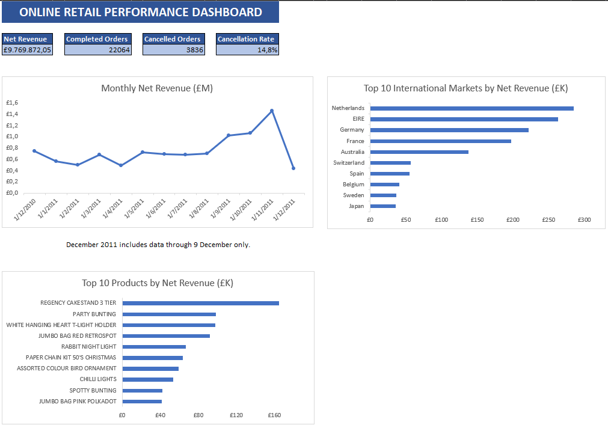

# Online Retail Power Query Analysis

An Excel portfolio project that transforms a large online retail transaction dataset into a clean, refreshable reporting workflow and management dashboard.

The project demonstrates practical use of **Excel**, **Power Query**, data cleaning, validation, aggregation, and business reporting for e-commerce and back-office operations.



## Project overview

- **Source records:** 541,909 transaction lines
- **Period covered:** 1 December 2010 to 9 December 2011
- **Tools:** Microsoft Excel and Power Query
- **Currency:** Pound sterling (GBP)
- **Output:** Revenue, order, market, and product analysis

## Dashboard results

| KPI | Result |
|---|---:|
| Net Revenue | £9,769,872.05 |
| Completed Orders | 22,064 |
| Cancelled Orders | 3,836 |
| Cancellation Rate | 14.8% |

In this project, **Completed Orders** means invoice numbers that are not marked as cancelled—that is, invoice numbers that do not begin with `C`. This is a transaction-status definition, not a revenue-eligibility rule. Of these invoices, 2,104 contain no line with `UnitPrice > 0` and therefore do not contribute to the net-revenue calculation.

> **Definition:** Completed = invoices not marked as cancelled. Net Revenue includes transactions with `UnitPrice > 0` and incorporates cancellations as negative quantities.

The dashboard also presents:

- monthly net revenue;
- the top 10 international markets by net revenue;
- the top 10 products by net revenue.

December 2011 contains data through 9 December only, so it should not be compared with complete months without this limitation in mind.

## Power Query workflow

The workbook uses separate queries so that the source, cleaning steps, calculations, and reporting outputs remain easy to follow.

1. **Raw_OnlineRetail** imports the original Excel dataset and assigns the correct data types.
2. **Clean_Transactions** trims and cleans text fields and classifies each transaction as `Completed` or `Cancelled`.
3. **Net_Sales_Transactions** removes rows with non-positive unit prices and calculates line revenue.
4. **Monthly_Revenue** groups net revenue by month.
5. **Country_Revenue** groups net revenue by country.
6. **Top_International_Markets** excludes the United Kingdom and unspecified locations, then retains the top 10 markets.
7. **Product_Analysis** calculates net revenue and units sold by product.
8. **Top_Products_By_Revenue** excludes postage-related codes and retains the top 10 products.
9. **Order_Summary** creates one record per invoice for status-based order and cancellation KPIs. It does not apply the revenue-eligibility filter.

## Key calculations

### Transaction status

According to the dataset documentation, an `InvoiceNo` beginning with `C` represents a cancellation.

```powerquery
if Text.StartsWith(Text.Upper([InvoiceNo]), "C")
then "Cancelled"
else "Completed"
```

### Line revenue

```powerquery
[Quantity] * [UnitPrice]
```

Negative quantities are retained. This allows cancellations and returns to reduce revenue rather than being incorrectly counted as positive sales.

### Cancellation rate

```text
Cancelled Orders / Total Orders
3,836 / 25,900 = 14.8%
```

## Data-quality decisions

- Approximately 25% of the `CustomerID` values are blank.
- These transactions were retained because they still contain valid sales information.
- Missing customer IDs were not replaced with invented values.
- Customer-level analysis was therefore excluded from the project.
- `CustomerID`, `InvoiceNo`, and `StockCode` were treated as identifiers rather than measures.
- Rows with `UnitPrice <= 0` were excluded from the revenue analysis.
- `DOT` and `POST` were excluded only from the product ranking because they represent charges rather than retail products.

## Validation

The final workbook was checked for consistency:

- 22,064 completed orders + 3,836 cancelled orders = 25,900 unique invoices;
- the cancellation-rate calculation reconciles to 14.8%;
- the sum of the 13 monthly revenue values reconciles to the dashboard net-revenue KPI;
- product and market rankings are sorted by descending net revenue;
- the dashboard formulas contain no visible Excel calculation errors;
- the Power Query refresh completes successfully.

During validation, a transaction for 80,995 units was investigated. A matching cancellation for -80,995 units was found shortly afterwards. Retaining both records correctly produces a net effect of zero and prevents the transaction from distorting the product ranking.

## Workbook structure

| Worksheet | Purpose |
|---|---|
| Dashboard | KPIs and management charts |
| Orders | One row per invoice and transaction status |
| Top Products | Top 10 products by net revenue |
| Top International Markets | Top 10 non-UK markets by net revenue |
| Monthly Revenue | Monthly net-revenue summary |

Supporting Power Query queries are stored as connections only, while the reporting tables are loaded into worksheets.

## Files

```text
Online_Retail_Power_Query_Analysis.xlsx
data/Online Retail.xlsx
screenshots/dashboard.png
README.md
```

## Refresh instructions

The Power Query source currently points to the original dataset on the creator's computer. After downloading the repository:

1. Open `Online_Retail_Power_Query_Analysis.xlsx`.
2. Open **Data Source Settings** in Excel.
3. Change the source path to `data/Online Retail.xlsx` on your computer.
4. Select **Data > Refresh All**.

The workbook's saved dashboard and results can still be viewed without refreshing.

## Dataset source and licence

Chen, D. (2015). *Online Retail* [Dataset]. UCI Machine Learning Repository.  
https://doi.org/10.24432/C5BW33

Dataset page: https://archive.ics.uci.edu/dataset/352/online%2Bretail

The dataset is licensed under the **Creative Commons Attribution 4.0 International licence (CC BY 4.0)**. The analysis, cleaning decisions, calculations, and dashboard in this repository were created for this portfolio project.

## Author

**Thanos Koulouris**  
Portfolio: https://thakoul.gr
